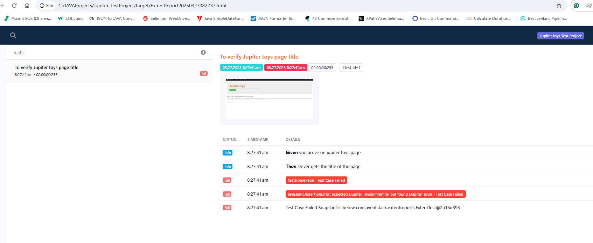

# Jupiter_TestProject

**Objective of the project**

URL of the website = https://jupiter.cloud.planittesting.com/#/

**Test case 1:**
1. From the home page go to contact page
2. Click submit button
3. Verify error messages
4. Populate mandatory fields
5. Validate errors are gone

**Test case 2:**
1. From the home page go to contact page
2. Populate mandatory fields
3. Click submit button
4. Validate successful submission message
   Note: Run this test 5 times to ensure 100% pass rate

**Test case 3:**
1. Buy 2 Stuffed Frog, 5 Fluffy Bunny, 3 Valentine Bear
2. Go to the cart page
3. Verify the subtotal for each product is correct
4. Verify the price for each product
5. Verify that total = sum(sub totals)

**Project set up**

1. Download and install JAVA (I have installed JDK 23.0.2)

* Visit website, https://www.oracle.com/in/java/ Click on the “Download Java” icon.
* Now you can see the latest version is JDK 23 and there are options for Linux, macOS, and Windows.
* Click the x64 Installer option to download the .exe file as per the operating system.
* Go to Downloads and double-click on that downloaded jdk-23_windows-x64_bin.exe file. So now Java Installation Wizard
  get open and then click Next button.
* Go to system properties in your computer, set up path variable for java. Ex:C:\Program Files\Java\jdk-23\bin and
  JAVA_HOME variable to where your jdk is. Ex: C:\Program Files\Java\jdk-23
* Open up command prompt and check the JAVA version. java --version

2. Download and install maven (I have installed Apache Maven 3.9.9 )

* Visit website https://maven.apache.org/download.cgi and download bin.zip for maven
* Copy the maven folder and paste it in program files of your computer
* Go to system properties in your computer, set up path variable for maven. C:\maven\apache-maven-3.9.9-bin and
  MAVEN_HOME variable to where your jdk is. C:\maven\apache-maven-3.9.9-bin\bin
* Open up command prompt and check the maven version. mvn -version

3. Download and install preferred IDE

4. Download and install git

* Visit website https://git-scm.com/downloads and download git as per operating system

5. clone repository -> https://github.com/niluherath/Jupiter_TestProject
   Use command git clone https://github.com/niluherath/Jupiter_TestProject.git

6. Open the project folder with your ide(as a maven project)

7. In your IDE set the JDK version and maven home path

8. Run command "mvn clean install" in your ide terminal. This will clean and install each module

9. Add sonar qube plugin for code scanning

10. maven dependencies added in the POM.xml

* testng for test framework building
  <!-- https://mvnrepository.com/artifact/org.testng/testng -->
  <dependency>
  <groupId>org.testng</groupId>
  <artifactId>testng</artifactId>
  <version>7.11.0</version>
  </dependency>

* extentreports dependency for reporting
  <!-- https://mvnrepository.com/artifact/com.aventstack/extentreports -->
  <dependency>
  <groupId>com.aventstack</groupId>
  <artifactId>extentreports</artifactId>
  <version>5.0.9</version>
  </dependency>

* selenium-java dependency for selenium
  <!-- https://mvnrepository.com/artifact/org.seleniumhq.selenium/selenium-java -->
  <dependency>
  <groupId>org.seleniumhq.selenium</groupId>
  <artifactId>selenium-java</artifactId>
  <version>4.30.0</version>
  </dependency>

* slf4j dependency for logging
  <!-- https://mvnrepository.com/artifact/org.slf4j/slf4j-api -->
  <dependency>
  <groupId>org.slf4j</groupId>
  <artifactId>slf4j-api</artifactId>
  <version>2.1.0-alpha1</version>
  </dependency>

* javafaker dependency to create random strings
  <dependency>
  <groupId>com.github.javafaker</groupId>
  <artifactId>javafaker</artifactId>
  <version>0.12</version>
  </dependency>
* webdriver manager dependency
  <!-- https://mvnrepository.com/artifact/io.github.bonigarcia/webdrivermanager -->
  <dependency>
  <groupId>io.github.bonigarcia</groupId>
  <artifactId>webdrivermanager</artifactId>
  <version>5.9.1</version>
  </dependency>

**Project structure**

1. src/main/java/com.base
   contains BasePage class

2. src/main/java/com.pageObjects
   contains page objects CartPage, ContactPage, HomePage, ShoppingMenuPage
   page objects inherit form BasePage class

3. src/main/java/com.utils
   contains, ConfigLoader, DateUtil, ExtentManager, PropertyUtils, WaitUtil
   ConfigLoader : calls the property utils class to get env variables from config properties file

4. src/main/java/config.properties
   stores env variables

5. src/test/java/com.base
   contains the BaseTest class

6. src/test/java/com.test
   contains test classes. Test classes inherit from BaseTest class

7. src/test/java/com.suite
   contains testng.xml files

8. pom.xml
   contains the maven dependencies

9. maven-test.yml:
   has steps to run in git hub actions
   

**Features of the test framework**

1. Ability to automate UI tests using selenium
2. Gherkin syntax to increase test case readability
3. Page object model to represent each web page and its functions
4. Extent reporting
5. CI/CD run in Git hub actions
6. Downloadable test report in workflow
7. screenshots upon test failure on the report
  *** In local failure screenshot only works on chrome browser and when you open on the location of your computer

**Running tests locally**

There are few ways to run tests in local,

1. right click on testng.xml file and then click on run
2. on terminal run command, mvn run test
3. In the Class, click on run button
4. to run all the suites together in local, right click and run the regression.xml
5. run test locally using terminal, use the command mvn test

**Test Reporting in local**

extent report will be created in target folder with a timestamp

**CI/CD run**

As soon as new code gets pushed to the repository GitHub actions, a workflow will be triggered
Once the workflow is completed you will be able to download a extent report

